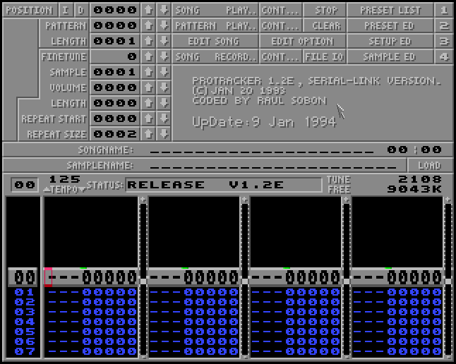

#Protracker 1.2e BUGFIXED(DUAL AMIGA VER)

Hook up 2 Amigas via serial port to play 8channels
via a NULL cable, they are synced up to each other
with in one 50hz field.

#NOTE:
 sorry for the last version being bugged up, that is
because I just grabbed my old disk and sent it up
assuming it worked , at least it did on 2 A500's
12months ago, but now???, so I hooked my A500 up
next to my A1200 to be sure this time, and what do you
know, BANG it crashed , so I went on to fix it and
here it is!

The Protrackers send the commands at 19200 buad to
each other, so they are really both masters to
each other.
*Commands*
	ascii  note
	-------------------
	 '1'   Play Song
	 '2'   Play Pattern
	 '3'   Record song
	 '4'   Stop all

------------------- pt12d docs follow ---------------------

This is the same as the old protracker 1.2b or so
but with the added benefit of doing real 8 channel
modules. What you do is hook up two amigas via a null
cable (serial to serial)  and then when you play/record
on one amiga it instantly (with maximum 20ms delay apart)
does the same on the other one, so just make two modules
which play well together and pressplay on either ONE!
then it will send the signal to do the same on the other
amiga. Playing via the gadgets will only play on your local
machine and playing via keyboard will do iton both
so ALT  or AMIGA will play serial and RSHIFT will 
make both record at once so you can edit the SO CALLED
8 tracks easily

I thought of this in early 1992 and then I implemented it in
protracker for a friend of mine. Then I saw the future options
for protracker 3.1 and they thought of it too but till
this date it still aint do it.  RIP it off me please!!!!!!

It also has pitch control for each track, nice to play with!

In the sample edit there is a button called MON
this monitors incoming audio from 8bit sampler and displays
it in full screen, cool to watch on HUGE TV!

Other hardware needed, yo need an audio mixed so you can
mix both amiga's audio signals together to get full 
8 channel audio.

OK all, so here it is have fun and the source is supplied
if you have any problems with timing etc...
You can change it your self!

BTW: all (most) pictures with in PT are IFF so they
all are included in to the thing when compiled (ASM)
I used devpac and it worked fine!
Do NOT USE Brilliance to save your IFF's they contain
an xtra chunk which the IFF decode code gets confused with
use DPAINT otherwise just fix the IFF DECODE code.
